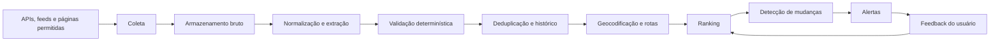

# Arquitetura do monitor de imóveis

Este documento descreve a implementação técnica das regras definidas em [AGENTS.md](./AGENTS.md).

## Objetivos

- Monitorar imóveis residenciais para aluguel e compra.
- Usar fontes verificáveis e preservar a evidência original.
- Aplicar requisitos obrigatórios por regras determinísticas.
- Usar IA para estruturar e analisar texto, nunca como fonte de verdade.
- Detectar anúncios novos, alterações relevantes e duplicidades.
- Destacar coberturas e possíveis direitos à laje sem afirmar direitos não comprovados.

## Princípios

1. **Fonte antes da IA:** APIs oficiais e feeds autorizados são a primeira opção; páginas públicas permitidas são o fallback.
2. **Evidência rastreável:** todo campo extraído mantém fonte, trecho, horário da consulta e nível de confiança.
3. **Regras determinísticas:** quartos, vaga, localização e limites financeiros não dependem de julgamento livre do modelo.
4. **Ausência não é confirmação:** campos não publicados permanecem como `não informado`.
5. **Finalidades separadas:** preço de compra, custo de aquisição e despesas recorrentes não são misturados com o custo mensal de aluguel.
6. **IA substituível:** o domínio não depende de um fornecedor ou modelo específico.

## Fluxo



### 1. Coleta

Cada conector implementa uma interface comum e retorna:

- plataforma, identificador externo, URL e finalidade;
- conteúdo bruto e, quando permitido, referências de imagens;
- horários de publicação, atualização e coleta;
- status da resposta e versão do conector.

Ordem de preferência:

1. API oficial ou parceria de dados;
2. feed estruturado autorizado;
3. e-mail ou alerta fornecido pela plataforma;
4. automação de navegador em páginas públicas, respeitando termos de uso, limites e `robots.txt`.

Os conectores devem aplicar timeout, retry com backoff e jitter, limitação de taxa e isolamento de falhas por fonte. Bloqueios de acesso não devem ser contornados.

#### Registro de conectores

A implementação atual usa um registro por hostname:

- conectores específicos para Viva Real, ZAP Imóveis, OLX, QuintoAndar e Imovelweb;
- extrator genérico para os demais domínios retornados pela Serper;
- extração preferencial de JSON-LD e, em seguida, cartões e links visíveis;
- resultado obrigatório por fonte: `ok`, `blocked`, `empty` ou `error`.

A Serper descobre páginas de busca, mas não é considerada fonte dos dados do imóvel. Os filtros de finalidade, preço, quartos, vagas e tipo são incluídos na consulta de descoberta, traduzidos para a URL do portal quando há regra conhecida e reaplicados sobre o modelo normalizado.

O modo visível é o padrão local porque o Viva Real retornou `403` no teste headless e `200` com Chrome visível. Esse comportamento não garante acesso futuro. CAPTCHA, Cloudflare e autenticação são reportados sem tentativa de contorno.

### 2. Armazenamento bruto

Salvar uma captura imutável do dado recebido antes de normalizá-lo. A captura permite auditoria, reprocessamento e comparação entre versões.

Dados mínimos:

- `source`, `external_id`, `url` e `fetched_at`;
- conteúdo bruto ou referência segura ao artefato;
- hash do conteúdo;
- código de resposta e metadados do conector.

### 3. Normalização e IA

Um parser determinístico trata dados estruturados. A IA é acionada somente para descrições ou campos ambíguos e deve responder em formato estruturado validado por schema.

Responsabilidades adequadas para a IA:

- extrair valores presentes no texto;
- reconhecer menções a cobertura, terraço, área externa e laje;
- classificar uma afirmação como explícita, ambígua ou ausente;
- apontar contradições e produzir resumo;
- sugerir possíveis duplicidades para validação posterior.

A IA não pode:

- inventar endereço, preço, vaga ou disponibilidade;
- converter “possibilidade de usar a laje” em direito juridicamente confirmado;
- aprovar um imóvel que falhe em requisito obrigatório;
- calcular valores que dependam de componentes ausentes.

Usar um modelo econômico com saída estruturada na extração comum e reservar um modelo mais capaz para ambiguidades. O modelo e a versão usados devem ser registrados em cada processamento.

Apartamentos exibem uma análise opcional sob demanda. O servidor valida o identificador contra a última coleta, abre a página de detalhes com Playwright e envia somente seu conteúdo textual para a IA. O retorno estruturado distingue direito à laje alegado documentalmente, menção não verificada, ausência e ambiguidade; churrasqueira só é marcada quando vinculada explicitamente à varanda. O conteúdo da página é tratado como entrada não confiável para reduzir risco de prompt injection. O resultado é armazenado localmente para evitar custo duplicado.

### 4. Modelo normalizado

Entidades principais:

- **Listing:** anúncio e finalidade (`rent` ou `sale`).
- **Property:** representação deduplicada do imóvel.
- **ListingVersion:** fotografia temporal de preço, descrição e disponibilidade.
- **Evidence:** campo extraído, valor, trecho da fonte, método e confiança.
- **Location:** endereço divulgado, coordenadas, precisão e origem.
- **RouteEstimate:** destino, modo a pé, duração, distância, provedor e horário.
- **Evaluation:** elegibilidade, prioridade geográfica, pontuação e motivos.
- **Alert:** evento enviado, canal, conteúdo e estado.
- **Feedback:** decisão do usuário e impacto futuro no ranking.

Valores monetários devem armazenar moeda e unidade temporal. Para aluguel, o total mensal só é calculado quando aluguel, condomínio e IPTU aplicáveis forem conhecidos. Para compra, armazenar separadamente preço de venda, preço por m², condomínio, IPTU e custos extraordinários divulgados.

### 5. Validação e deduplicação

O motor de regras aplica primeiro os requisitos de [AGENTS.md](./AGENTS.md). Em seguida, a deduplicação combina:

- plataforma e identificador externo;
- URL canônica;
- endereço aproximado e coordenadas;
- área, quartos, vagas e preço;
- similaridade da descrição;
- hashes perceptuais de imagens, quando seu uso for permitido.

Correspondências exatas podem ser unificadas automaticamente. Correspondências probabilísticas devem manter pontuação, evidências e possibilidade de revisão.

### 6. Localização e rotas

Geocodificar apenas a precisão divulgada pelo anúncio. Não apresentar número exato quando a fonte informa somente rua ou região.

Consultar rota a pé para:

- Praia de Botafogo, 501;
- estação de metrô mais próxima.

Armazenar provedor, data da consulta, duração, distância e precisão da origem. Distância em linha reta pode ser usada apenas como fallback identificado.

### 7. Ranking

Separar dois resultados:

- **prioridade geográfica:** alta, média ou baixa, conforme [AGENTS.md](./AGENTS.md);
- **pontuação de características:** preferências adicionais do imóvel.

A elegibilidade é um filtro anterior ao ranking. Cobertura e direito à laje recebem peso alto. Churrasqueira na varanda, terraço e área externa recebem bônus. O tipo da vaga recebe peso baixo, embora a existência de pelo menos uma vaga seja obrigatória.

Para laje, usar estados distintos:

- `not_mentioned`;
- `mentioned_unverified`;
- `document_claimed`;
- `document_verified`.

Um anúncio, por si só, normalmente alcança no máximo `document_claimed`. `document_verified` exige conferência documental.

### 8. Histórico e alertas

Gerar evento somente para:

- anúncio elegível ainda não reportado;
- redução de preço relevante;
- mudança de disponibilidade;
- nova evidência de cobertura, laje ou requisito obrigatório;
- correção material de dados.

Usar uma chave idempotente por imóvel, tipo de evento e versão para impedir alertas repetidos. O alerta deve separar aluguel e compra e apontar dados pendentes.

### 9. Persistência PostgreSQL e janela semestral

O PostgreSQL é a fonte de verdade para descobertas, coletas, imóveis e análises. A estrutura relacional contém:

- `search_runs`: consulta, filtros, resposta da descoberta, datas e totais;
- `source_collections`: resultado técnico de cada portal;
- `properties`: identidade estável e datas de primeira, última e última pesquisa elegível;
- `property_listings`: aliases e URLs por fonte;
- `search_results`: snapshot de cada aparição e decisão de elegibilidade;
- `property_analyses`: análise estruturada da IA e validade.
- `property_analysis_reviews`: respostas humanas para campos que a IA classificou como ambíguos.

A identidade não inclui preço, permitindo reconhecer o mesmo imóvel após uma alteração de valor. Identificadores externos confiáveis têm prioridade; URLs canônicas são o fallback conservador.

Durante a persistência, cada imóvel é bloqueado dentro de uma transação. Se `last_researched_at` estiver ausente ou tiver pelo menos seis meses, o imóvel é liberado. A coleta não altera essa data: somente a conclusão da análise por IA inicia uma nova janela. Caso contrário, a aparição é registrada com `suppressed_until`, mas não é devolvida como resultado novo. Reaparições suprimidas não estendem o prazo.

Análises da IA válidas também são reutilizadas por seis meses. A aplicação opera em modo fail-closed: sem banco disponível, a pesquisa falha em vez de ignorar a proteção contra repetição.

O histórico usa uma linha por imóvel, correspondente à reaparição mais recente, e agrupa os itens em: laje, churrasqueira na varanda, ambos, nenhum ou ambíguo. Uma resposta humana pode resolver apenas campos originalmente ambíguos; ela fica separada do resultado imutável da IA e passa a determinar o grupo exibido.

Operação local:

```text
npm run db:migrate
npm run db:check
npm run db:import-json
```

As migrações são versionadas em `db/migrations`. O importador transfere o histórico JSON existente, que deixa de ser a fonte de verdade após a migração.

## Componentes implementados e sugeridos

- **TypeScript e Next.js** para interface, APIs, regras e conectores atuais.
- **PostgreSQL** em produção; SQLite pode ser usado no protótipo local.
- **Fila de tarefas** somente quando volume ou confiabilidade exigirem processamento assíncrono.
- **Playwright** para fontes sem integração estruturada, quando autorizado.
- **Provedor de mapas** para geocodificação e rotas a pé.
- **API de LLM** com saída estruturada, timeout, retry e limite de custo.
- **Agendador** para coletas periódicas e revalidação.

O núcleo de domínio deve usar interfaces para conectores, mapas, modelos de IA e canais de alerta, permitindo troca de fornecedores.

## Configuração e segredos

Configurações não sensíveis podem residir em arquivo versionado. Tokens, chaves, credenciais e strings de conexão devem vir de variáveis de ambiente, arquivo `.env` local não versionado ou secret manager.

Variáveis esperadas podem incluir:

```text
DATABASE_URL
LLM_API_KEY
MAPS_API_KEY
ALERT_CHANNEL_TOKEN
PLAYWRIGHT_HEADLESS
PLAYWRIGHT_CHANNEL
PLAYWRIGHT_CONCURRENCY
PLAYWRIGHT_SETTLE_MS
```

Manter apenas placeholders em exemplos e incluir `.env` no `.gitignore`.

## Observabilidade e qualidade

Registrar métricas de coleta por fonte, anúncios processados, erros de schema, custo e latência da IA, duplicidades, imóveis elegíveis e alertas enviados.

Testes mínimos:

- testes unitários das regras de elegibilidade e custos;
- casos de contrato para cada conector;
- exemplos fixos para extração estruturada;
- testes de deduplicação;
- testes de idempotência dos alertas;
- testes de regressão para cobertura e direito à laje;
- smoke test do fluxo completo sem envio real.

## Entrega incremental

1. Implementar modelo normalizado, banco local e uma fonte.
2. Aplicar filtros de aluguel e compra e persistir histórico.
3. Integrar geocodificação e rotas.
4. Adicionar extração estruturada por IA com evidências.
5. Implementar deduplicação, ranking e alertas idempotentes.
6. Adicionar novas fontes, feedback e observabilidade.

Antes de ativar o monitoramento de compra, definir o teto de preço e as condições relevantes de entrada ou financiamento.
